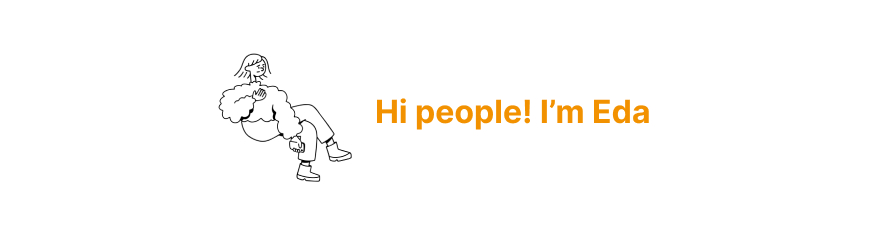

👋 

🤓 I am a product designer.

📫 I am curious about people and I like thinking about how people's minds work. I enjoy figuring out how people use products.

📱 I advocate making digital products and services accessible to everyone with the possibility of technology.

💌 Check out [my website](https://edakizak.wixsite.com/my-site)

📡 Contact me on 

### 💈 Languages 

   

### 🧬 Design Tools

   

